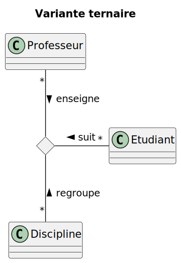

# Diagramme de classe

## Vrai ou faux

Etant donné le diagramme de domaine ci-dessus, les assertions suivantes sont-elles vraies ou fausses ? 
- Etudiant est une classe d’association **FAUX**
- Un étudiant peut participer à autant de cours qu’il veut **VRAI**
- Plusieurs professeurs peuvent enseigner la même discipline **FAUX, 1 seul prof**
- Un professeur peut enseigner plusieurs disciplines **VRAI**
- Un cours peut être enseigner à 2 étudiants **FAUX**
- Un cours peut être enseigner à 20 étudiants **VRAI**

## Question ouverte

Représentez la même association avec la notation UML « petit losange » 

**Voici ma solution**

- Quelles informations perd-on par rapport au diagramme ci-dessus ? 

**On perd la possibilité de spécifier le 5..30 et d'augmenter la classe Cours par des attributs... ce n'est pas vraiment une amélioration de notre modélisation de départ, elle devient moins flexible et moins clair au niveau des cardinalités comme c'est le sens inverse.**

